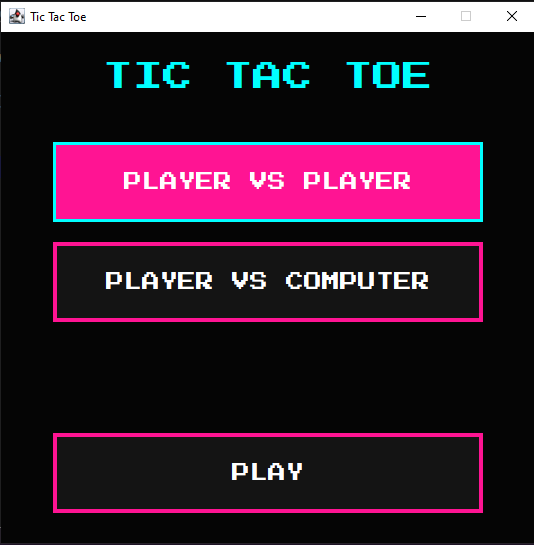
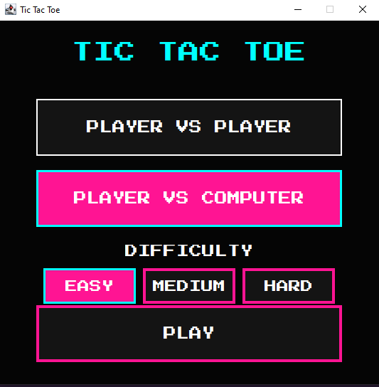
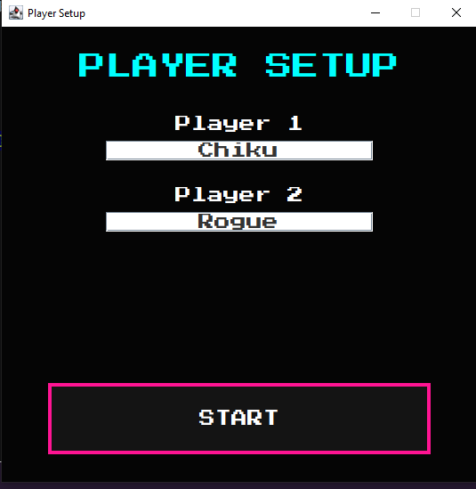
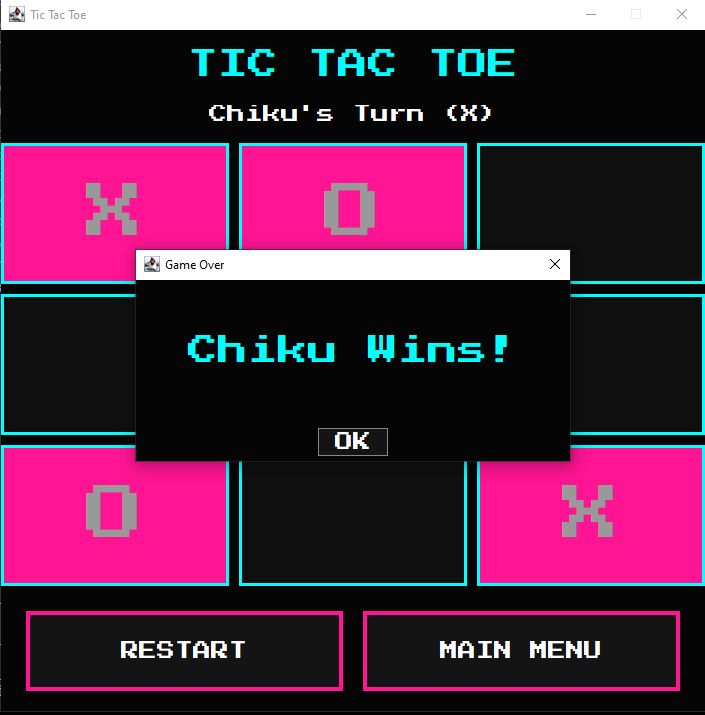
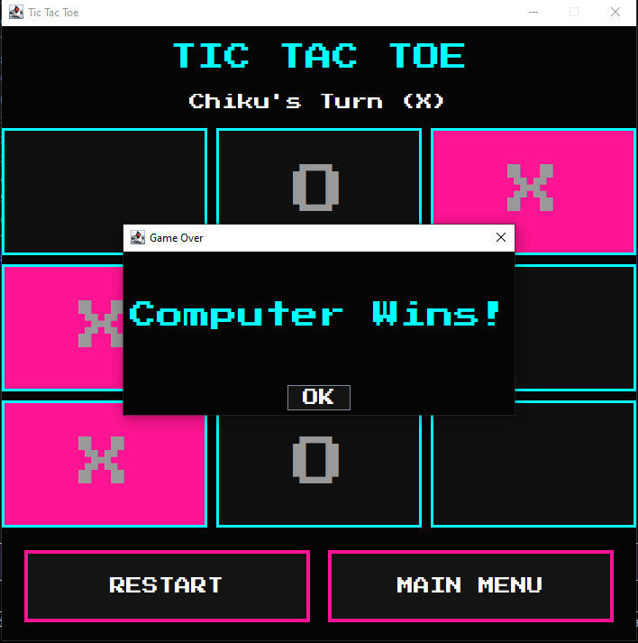
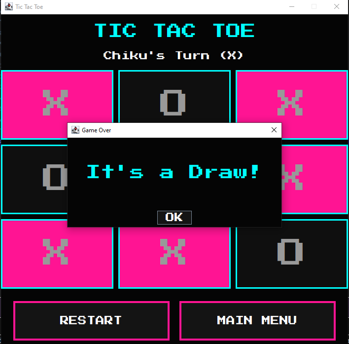

# Tic Tac Toe (Java)

A Java Tic Tac Toe game featuring both a console version and a Swing GUI with multiple game modes and three AI difficulty levels.

---

## Screenshots

### Home Screen

### Difficulty Selection

### Player Setup

### Gameplay

### Player vs Computer

### Game Over

---
## Development Journey

I initially built Tic Tac Toe as a console application to focus on implementing the core game logic, including player turns, move validation, win detection, and draw detection.

Once the gameplay logic was working reliably, I used that experience to develop a graphical version using Java Swing. The Swing application extends the original project by introducing an interactive user interface, multiple game modes, and three AI difficulty levels.

The AI was designed with increasing complexity:
- **Easy:** Random move selection.
- **Medium:** Detects winning opportunities and blocks the player's winning moves.
- **Hard:** Uses the Minimax algorithm to evaluate every possible game state and choose the optimal move, making it impossible to beat with perfect play.
